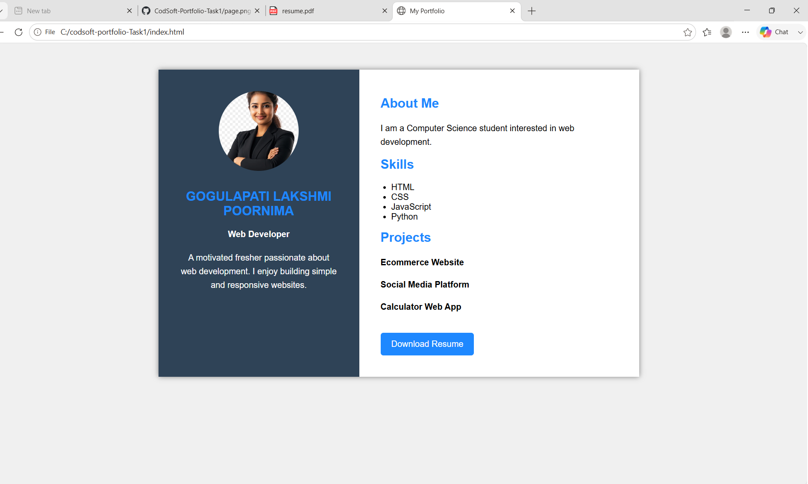

# CodSoft-Portfolio-Task1

## 📌 Project Title

Personal Portfolio Website

## 💼 Portfolio Website

This project is created as part of the CodSoft Web Development Internship (Level 1 Task 1).

## 👩‍💻 Intern Details

**Name:** Gogulapati Lakshmi Poornima
**Intern ID:** BY26RY206292
**Domain:** Web Development
**Organization:** CodSoft

## 📖 Project Description

This is a simple personal portfolio website developed using HTML and CSS. The portfolio showcases personal and professional details in a clean and structured layout.

The website includes:

* Profile Photo
* Name & Role
* About Me Section
* Skills
* Projects
* Contact Information
* Resume Download Button

This project helped in understanding the basics of:

* Website Structure
* Layout Design
* Styling using CSS
* Creating a Responsive Portfolio

## 🛠️ Technologies Used

* HTML
* CSS

## 📂 Project Files

* index.html
* style.css
* photo.png
* resume.pdf
* README.md

## 🎯 Objective

To create a simple personal portfolio website as part of the CodSoft Internship Level 1 Task 1.

## 🚀 Live Website

GitHub Pages Live Site:

👉 Add your GitHub Pages link here

https://poornimagogulapati-a11y.github.io/codsoft-portfolio-Task1/

## 📸 Output Screenshot

